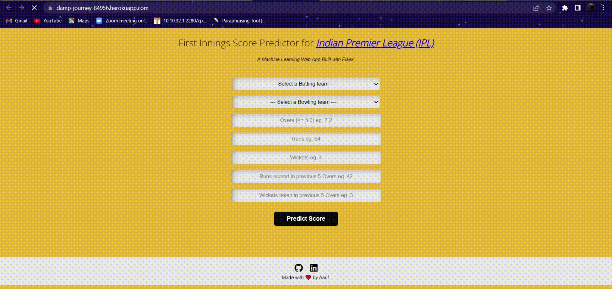

# IPL First Innings Score Prediction
This a IPL Score Predictior Which Predicts the Projected Score at the end of the First-innings with some current playing Data.

# Tech Stack
Python
Flask(Backend)
Heroku(Paas)

• This repository consists of files required to deploy a ___Machine Learning Web App___ created with ___Flask___ on ___Heroku___ platform.

## Instruction
#### To run locally,
1) Clone this repository with `git clone`.
2) Open a terminal inside the project directory.
3) Install dependencies using `pip install -r requirements.txt`
3) Run `python app.py` to open the app on `localhost:5000`.

• If you want to view the deployed model, click on the following link: 
Deployed at: https://damp-journey-84956.herokuapp.com/

• If you are searching for __Code__, __Algorithms used__ and __Accuracy__ of the model.. you won't find it here. Click the link mentioned below for the same: 
Link: _

• A glimpse of the web app:

 
 
_**----- Important Note -----**_ 
• If you encounter this webapp as shown in the picture given below, it is occuring just because **free dynos for this particular month provided by Heroku have been completely used.**
• Sorry for the inconvenience.

